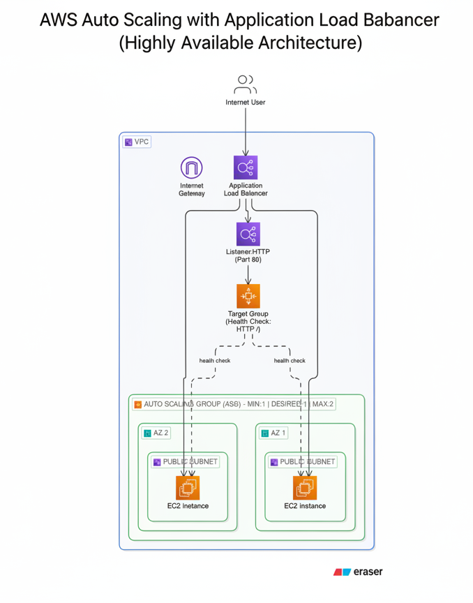

## 🏗️ Architecture

This diagram represents a highly available and self-healing AWS architecture using an Application Load Balancer (ALB) and Auto Scaling Group (ASG).

---

### 🖼️ Architecture Diagram

---

### 📌 Architecture Flow

1. User sends request through the internet
2. Request is received by the **Application Load Balancer (ALB)**
3. ALB forwards traffic to the **Target Group**
4. Target Group routes requests to EC2 instances managed by **Auto Scaling Group (ASG)**
5. EC2 instances serve the response

---

### ⚙️ Key Components

* **Application Load Balancer (ALB)** – Entry point for user traffic
* **Target Group** – Connects ALB with EC2 instances
* **Auto Scaling Group (ASG)** – Automatically maintains instance count
* **EC2 Instances** – Hosts the application
* **VPC & Public Subnets** – Provide network infrastructure
* **Internet Gateway** – Enables internet access for public subnets

---

### 💡 Key Highlights

* Multi-AZ deployment ensures **high availability**
* Auto Scaling provides **self-healing capability**
* Load balancing distributes traffic efficiently
* Only healthy instances receive traffic

---

### 🔥 Interview Insight

> “This architecture ensures high availability by combining load balancing and Auto Scaling, where ALB distributes traffic and ASG replaces unhealthy instances automatically.”
